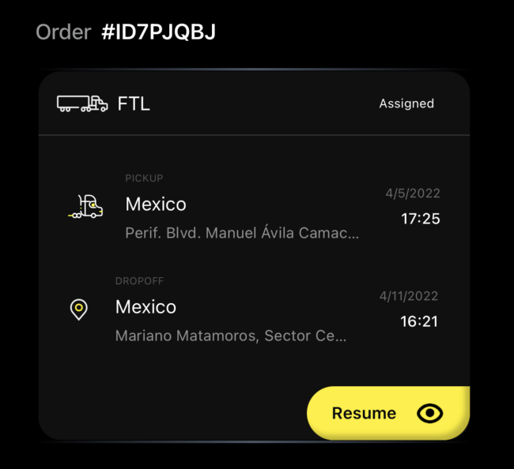
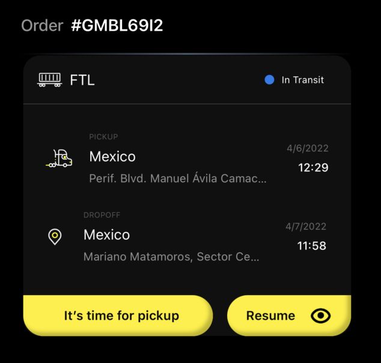
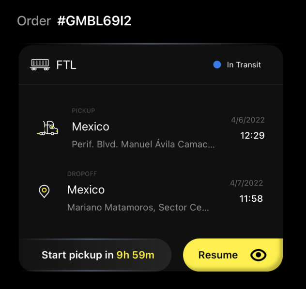
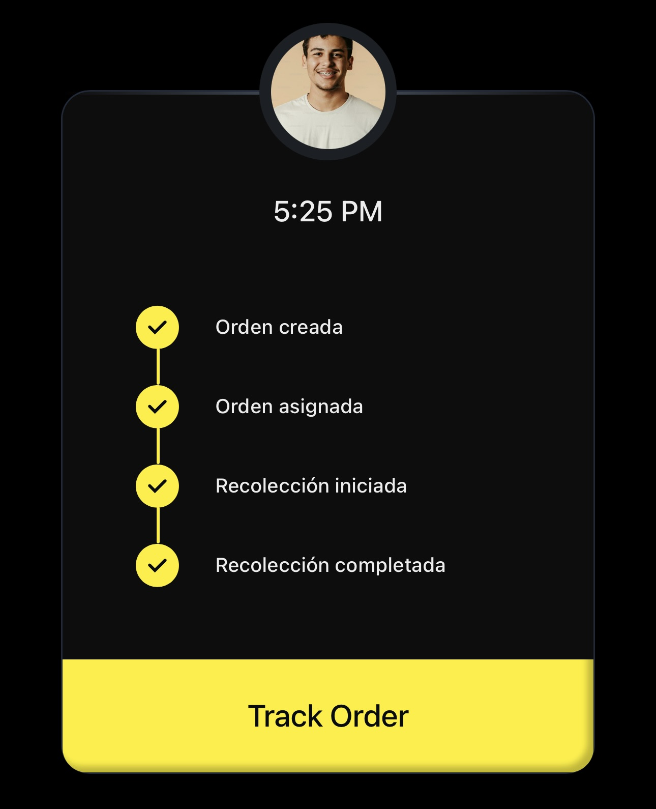
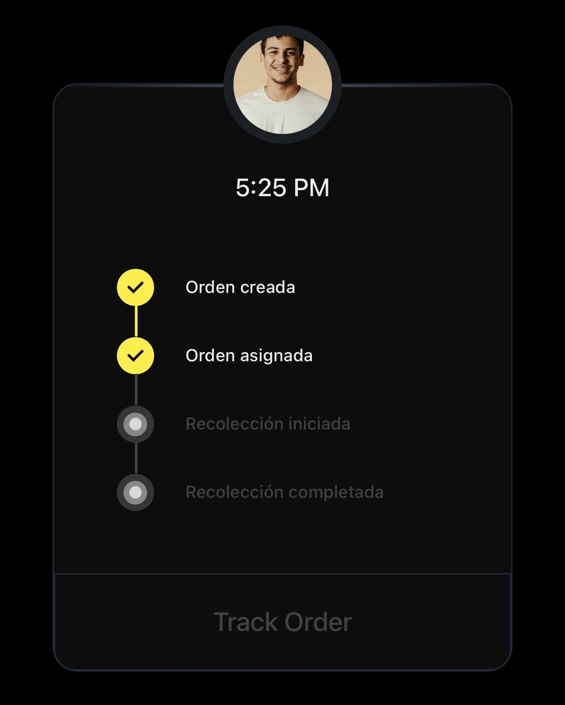

# Cargo Tracking App

Esta es la solución brindada a la prueba técnica. A continuación se presentan las tecnologías utilizadas y las prácticas seguidas.


## Tecnologías Utilizadas

- **React + TypeScript:** Desarrollo de la interfaz de usuario con tipado estático y componentes reutilizables.
- **Vite:** Herramienta de build y desarrollo rápido para proyectos modernos de frontend.
- **TailwindCSS:** Utilizado para el diseño responsivo y la rápida maquetación de estilos.

## Prácticas y Estructura

- **Componentización:** El proyecto está dividido en componentes pequeños y reutilizables, facilitando el mantenimiento y la escalabilidad.
- **Tipado Estricto:** Uso intensivo de TypeScript para evitar errores comunes.
- **Estructura de las Carpetas:** Separación clara entre componentes,páginas, hooks, contextos, utilidades y tipos.
- **Estilos Consistentes:** Uso de TailwindCSS para mantener una apariencia uniforme y responsiva.

## Estructura de Carpetas

- `src/components`: Componentes reutilizables de la interfaz.
- `src/pages`: Vistas principales de la aplicación.
- `src/context`: Contextos globales para manejo de estado.
- `src/hooks`: Hooks personalizados para lógica reutilizable.
- `src/utils`: Funciones utilitarias y formateadores.
- `src/types`: Definiciones de tipos y modelos de datos.

## Cómo iniciar el proyecto

1. Instalar dependencias:
   ```bash
   npm install
   ```
2. Iniciar el entorno de desarrollo:
   ```bash
   npm run dev
   ```
---
## Ejemplos de lógica aplicada en la página

### En Cargo Orders
#### Caso donde el status de la orden es "Orden Asignada" => Assigned


#### Caso donde el status de la orden es "Recolección completada" => In transit, y ya se cumplió el start_date


#### Caso donde el status de la orden es "Recolección completada" => In transit, y aún no se ha cumplido el start_date


### En Cargo Details
#### Caso donde se habilita el botón de Track Order


#### Caso donde no se habilita el botón de Track Order



